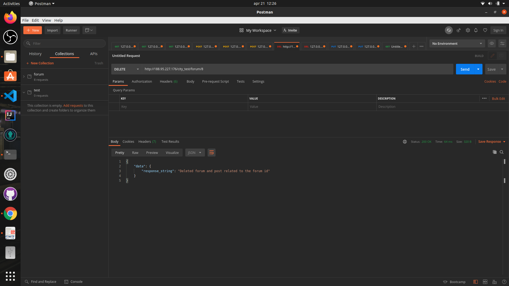

# City_network_test
REST API for forum 

## Command by Sequence while development

- npm init -y

- npm install express

- npm install dotenv

- npm install nodemon

- npm install mysql2

- create server.js and write
- create .env file
- create database.js and write

## To run the project use 

- clone the repo
- cd to project_folder
- npm install
- npm start

## Screenshot of the project and postman
- SSH pic

- Postman pic

**********************************************************************************************************************************
# Extra instruction

The REST-API service is deployed on the server with the Nginx
Previusly the instruction were there as deployed index file on ip  

Since instruction were not passed to remove that 
so i deployed a REST-API service wih change in url param
through Nginx(check in etc/nginx/sites-enabled) 
Thus the REST-API will be on http://188.95.227.176/city_test/ and so on
The http://188.95.227.176/ is showing instruction as before.

*********************************************************************************

For task 1 go to  or make a GET request
http://188.95.227.176/city_test/forum
http://188.95.227.176/city_test/post
http://188.95.227.176/city_test/user
http://188.95.227.176/city_test/forum/<id>
http://188.95.227.176/city_test/post/<id>
http://188.95.227.176/city_test/user/<id>

and similarly following paths for different tasks 

Also you can check the REST-API at http://127.0.0.1:3001/

http://127.0.0.1:3001/forum/
http://127.0.0.1:3001/post/
http://127.0.0.1:3001/user/
http://127.0.0.1:3001/forum/<id>
http://127.0.0.1:3001/post/<id>
http://127.0.0.1:3001/user/<id>

and similarly

********************************************************************************

The project location is in city_network_test/City_network_test
The main program is in server.js
The file database.js have some funtion to commet to MySQL server
To run the application pm2 is used and to check the service is running(daemon) use commad 'pm2 list' 
please follow through the comment in the program file server.js

                            Task 1
GET Request
	GET /forum
	GET /post
	GET /user
	GET /forum/<id>
	GET /post/<id>
	GET /user/<id>

                            Task 2,7
DELETE Request
	DELETE /forum/<id>
                    If this request is called than the forum with provide id id deleted
	                And also delete all the post related to that specicif forum_id to keep database clean and consistent. 
	                This will in provide also satisfy the TASK #7

	DELETE /post/<id>
                    
                            Task 3
PUT Request
	PUT /forum/<id>
	PUT /post/<id>

                            Task 4
POST Request
	POST /forum
	POST /post

		datetime will be according to current timme
		Date time is taken but not used the datatime will be set by itself 
		since a specfic foramte is needed and if not the request is failed by DB 
		So keeping in mind it has been done and if data time is passed correctly 
		Than commet the currentTime variable and in SQL query insteed of it pass the data1.created parameter it will work fine 

		The function is also cheking if there is post is having correct forum_id to keep data consistent and same could be done for user_id 
		but according to the task no such details have been provided so it was not done and 
		There is a scope of improving DB by foreign key but it may very well deviate from current tasks
		so it is not done to satisft the provided task which are neccessary for test but via comment 
		it to be noted that the point was noticed.   

	POST /user

